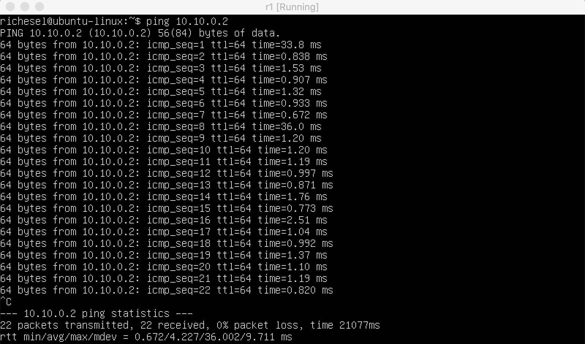

## Part 1. Инструмент **ipcalc**
поднял виртуальную машину 

установил ipcalc

1.адрес сети 192.167.38.54/13

Перевод маски 255.255.255.0 в префиксную и двоичную запись

 Перевод маски /15 в обычную и двоичную запись

.1.2.3 Перевод маски 11111111.11111111.11111111.11110000 в обычную и префиксную запись запись

2.Минимальный и максимальный хост в сети 12.167.38.4 при маска:   
- 1.1.3.1 /8

- 1.1.3.2 11111111.11111111.00000000.00000000

- 1.1.3.3 255.255.254.0

- 1.1.3.4 /4

### 1.2. localhost
localhost (локальный хост) — в компьютерных сетях, стандартное, официально зарезервированное доменное имя для частных IP-адресов (в диапазоне 127.0.0.1 — 127.255.255.254)

Можно ли обратиться к приложению, работающему на localhost, со следующими IP:

194.34.23.100 - нет

127.0.0.2 - да

127.1.0.1 - да

128.0.0.1 - нет

### 1.3. Диапазоны и сегменты сетей
Все IP-адреса протокола IPv4 делятся на публичные/глобальные/внешние (их называют "белые") — они используются в сети Интернет, и частные/локальные/внутренние (их называют "серые") — используются в локальной сети.

К частным "серым" адресам относятся IP-адреса из следующих подсетей:

От 10.0.0.0 до 10.255.255.255 с маской 255.0.0.0 или /8

От 172.16.0.0 до 172.31.255.255 с маской 255.240.0.0 или /12

От 192.168.0.0 до 192.168.255.255 с маской 255.255.0.0 или /16

От 100.64.0.0 до 100.127.255.255 с маской подсети 255.192.0.0 или /10

Какие из перечисленных IP можно использовать в качестве публичного, а какие только в качестве частных:

10.0.0.45 - частный

134.43.0.2 - публичный

192.168.4.2 - частный

172.20.250.4 - частный
172.0.2.1 - публичный

192.172.0.1 - публичный

172.68.0.2 - публичный

172.16.255.255 - частный

10.10.10.10 - частный

192.169.168.1 - публичный

Какие из перечисленных IP адресов шлюза возможны у 
сети 10.10.0.0/18:

10.0.0.1 - нет

10.10.0.2 - да

10.10.10.10 - да

10.10.100.1 - нет

10.10.1.255 - да
## Part 2. Статическая маршрутизация между двумя машинами
С помощью команды ip a посмотреть существующие сетевые интерфейсы

ws2

ws1

 Установка для машины ws1 адреса 192.168.100.10/16 открывем  через vim etc/netplan/00-installer-config.yaml

 Отчет вывода команды ip a для машины ws2 открывем  через vim etc/netplan/00-installer-config.yaml
 
 sudo netplan apply 
 ws1. Вывод результата пингования
  
   sudo netplan apply 
 ws2. Вывод результата пингования
   

Добавление статического маршрута с сохранением
Добавление статического маршрутка от машины ws1 к ws1 после перезапуска 
 
Добавление статического маршрута с сохранением
Добавление статического маршрутка от машины ws1 к ws2 после перезапуска 
 

 принятия изменения и пингования машины ws1 к ws2
 
 принятия изменения и пингования машины ws2 к ws1
  
 ## Part 3. Утилита **iperf3**
- 8 Mpbs = 1 MB/s
- 100 MB/s = 800000 Kbps
- 1 Gbps = 1000 Mbps
#### 3.2. Утилита **iperf3**
 
 Установка машины ws1 как сервер при помощи команды iperf3 -s с последующим измерением скорости соединения
 Установка машины ws2 как принимающего устройства при помощи команды iperf3 -c 192.168.100.10 -p 5201
 
## Part 4. Сетевой экран

#### 4.1. Утилита **iptables**
 Файл firewall.sh с содержимым для машины ws1
 
  Файл firewall.sh с содержимым для машины ws2
   
Содержимое файлов /etc/firewall.sh. Входящие пакеты от портов 22 и 80 по протоколу tcp разрешены. На ws1 подряд прописаны правила запрещающие и разрешающие echo-reply. На ws2 в разрешающем правиле прописан другой ключ (-I OUTPUT 1 вместо -A OUTPUT), который добавляет правило в начало цепи, вместо конца.
#### 4.2. Утилита **nmap**
##### Командой **ping** найти машину, которая не "пингуется", после чего утилитой **nmap** показать, что хост машины запущен
Пропинговываем машину ws2. Вызываем функцию nmap для поверки подключения порта
 
  Пропинговываем машину ws2. Вызываем функцию nmap для поверки подключения порта
   
   ## Part 5. Статическая маршрутизация сети
Поднять пять виртуальных машин (3 рабочие станции (ws11, ws21, ws22) и 2 роутера (r1, r2))
   
#### 5.1. Настройка адресов машин
Настроить конфигурации машин в etc/netplan/00-installer-config.yaml согласно сети на рисунке.
 
 Перезапустить сервис сети командой ip - 4 a  и принять настройки сети 
  
  пропинговать r1 с ws11.
  
  

#### 5.2. Включение переадресации IP-адресов. 
выполнить команду на роутерах:sysctl -w net.ipv4.ip_forward=1

Откройте файл /etc/sysctl.conf и расскоментировать строку
net.ipv4.ip_forward=1

#### 5.3. Установка маршрута по-умолчанию

вывода команды ip r

Пропинговать с ws11 роутер r2 и показать на r2, что пинг доходит.
c командой: tcpdump -tn -i eth1

#### 5.4. Добавление статических маршрутов
Добавить в роутеры r1 и r2

Вызвать ip r на r1 и r2

Запустить команды на на машине ws11:ip r list 10.10.0.0/[маска сети] и ip r list 0.0.0.0/0

## 5.5. Построение списка маршрутизаторов

Запустить на r1 команду дампа:

При помощи утилиты traceroute построить список маршрутизаторов на пути от ws11 до ws21:

 Принцип работы traceroute

Для определения промежуточных маршрутизаторов traceroute отправляет серию пакетов данных целевому узлу, при этом каждый раз увеличивая на 1 значение поля TTL («время жизни»). Это поле обычно указывает максимальное количество маршрутизаторов, которое может быть пройдено пакетом. Первый пакет отправляется с TTL, равным 1, и поэтому первый же маршрутизатор возвращает обратно сообщение ICMP, указывающее на невозможность доставки данных. Traceroute фиксирует адрес маршрутизатора, а также время между отправкой пакета и получением ответа (эти сведения выводятся на монитор компьютера). Затем traceroute повторяет отправку пакета, но уже с TTL, равным 2, что позволяет первому маршрутизатору пропустить пакет дальше.

Процесс повторяется до тех пор, пока при определённом значении TTL пакет не достигнет целевого узла. При получении ответа от этого узла процесс трассировки считается завершённым.
#### 5.6. Использование протокола **ICMP** при маршрутизации
5.6.1 Вывод команды ping -c 1 10.30.0.111 на машине ws11

5.6.2 Вывод команды tcpdump -n -i eth0 icmp на машине r1

## Part 6. Динамическая настройка IP с помощью **DHCP**
1) указать адрес маршрутизатора по-умолчанию, DNS-сервер и адрес внутренней сети.
 

в файле resolv.conf прописать nameserver 8.8.8.8.
 
 
ws21 перезагрузить при помощи reboot и выполнить команду ip a пропинговать ws22 с ws21.

Указать MAC адрес у ws11, для этого в etc/netplan/00-installer-config.yaml надо добавить строки: macaddress: 10:10:10:10:10:BA, dhcp4: true

Для r1 настроить аналогично r2, но сделать выдачу адресов с жесткой привязкой к MAC-адресу (ws11)

sudo dhclient -r  =  удаление старого ip
sudo dhclient     = выдача нового ip

Сохранить дампы образов виртуальных машин, через Export to OCI
## Part 7. NAT
В файле /etc/apache2/ports.conf на ws22 и r1 изменить строку Listen 80 на Listen 0.0.0.0:80, то есть сделать сервер Apache2 общедоступным

Запустить веб-сервер Apache командой service apache2 start на ws22 и r1

Добавить в фаервол, созданный по аналогии с фаерволом из Части 4, на r2 следующие правила:
1) удаление правил в таблице filter - iptables -F
2) удаление правил в таблице "NAT" - iptables -F -t nat
3) отбрасывать все маршрутизируемые пакеты - iptables --policy FORWARD DROP

Запускать файл также, как в Части 4

Проверить соединение между ws22 и r1 командой ping При запуске файла с этими правилами, ws22 не должна "пинговаться" с r1

Добавить в файл ещё одно правило:
4) разрешить маршрутизацию всех пакетов протокола ICMP

Запускать файл также, как в Части 4

Проверить соединение между ws22 и r1 командой ping
При запуске файла с этими правилами, ws22 должна "пинговаться" с r1

Добавить в файл ещё два правила:
5) включить SNAT, а именно маскирование всех локальных ip из локальной сети, находящейся за r2 (по обозначениям из Части 5 - сеть 10.20.0.0)
6) включить DNAT на 8080 порт машины r2 и добавить к веб-серверу Apache, запущенному на ws22, доступ извне сети

Запускать файл также, как в Части 4

Проверить соединение по TCP для SNAT, для этого с ws22 подключиться к серверу Apache на r1 командой:telnet [адрес] [порт]

Проверить соединение по TCP для DNAT, для этого с r1 подключиться к серверу Apache на ws22 командой telnet (обращаться по адресу r2 и порту 8080)

Сохранить дампы образов виртуальных машин через Export to OCI

